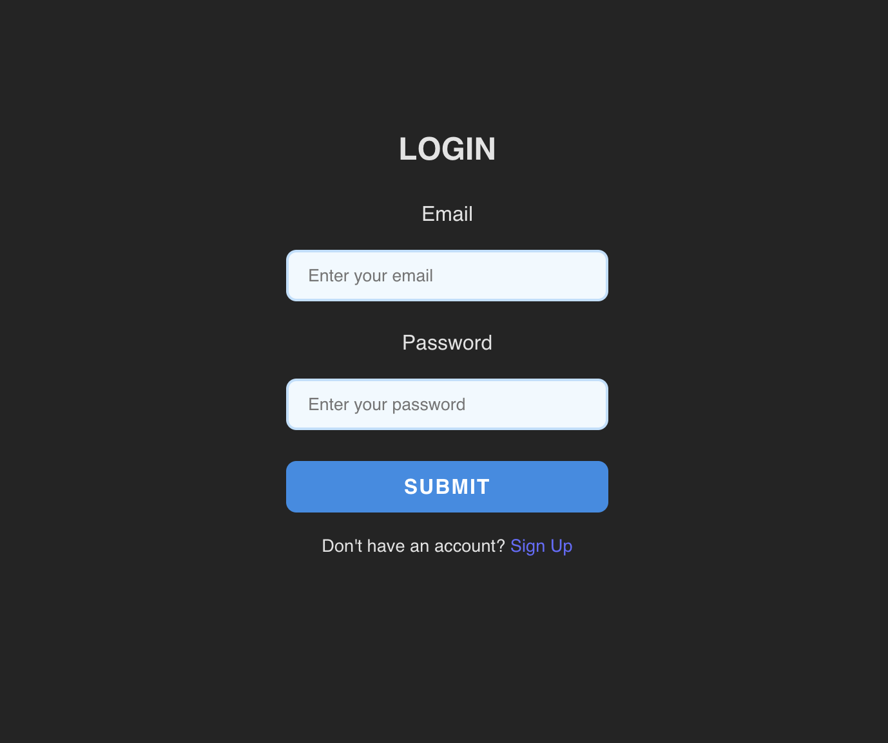
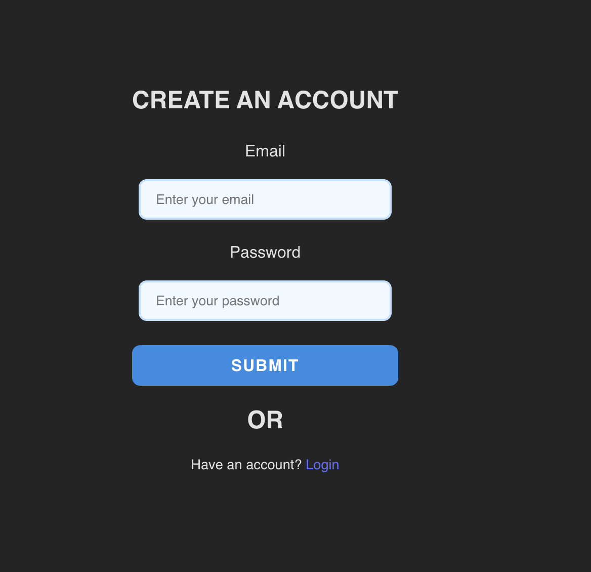
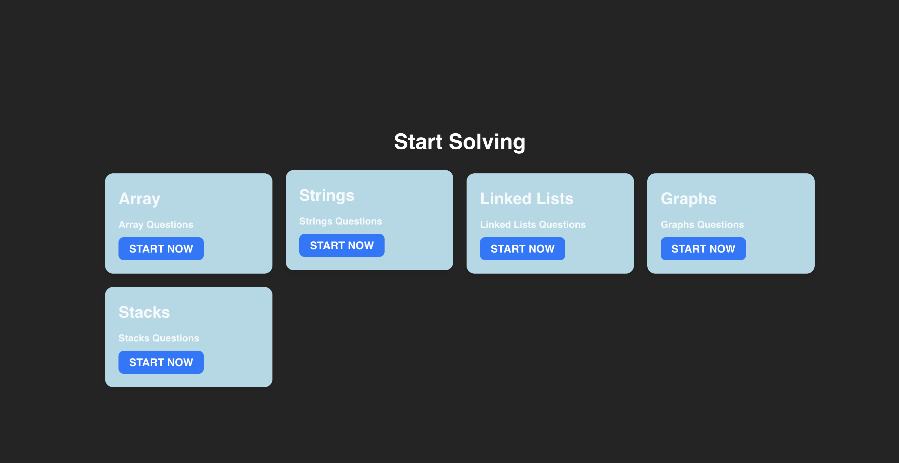
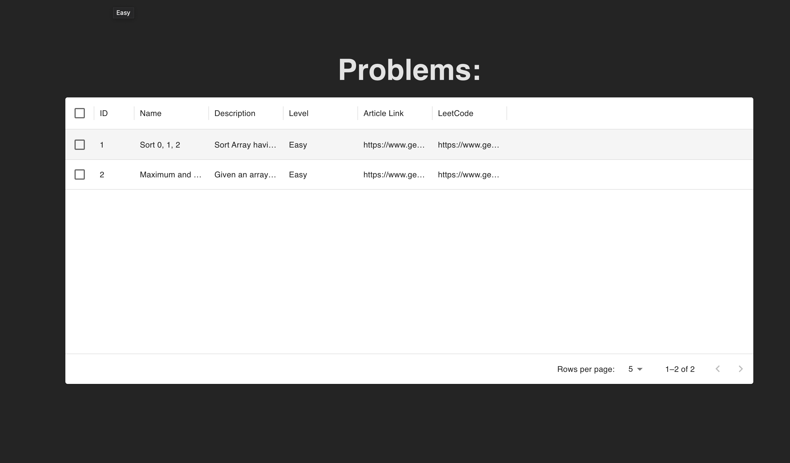

# DSA Sheet UI

A sleek and intuitive React application for managing and visualizing your DSA (Data Structures and Algorithms) progress. Built with Vite for fast development and optimized performance.

## 🚀 Features

- Interactive dashboard to track your DSA progress.
- Organized topic-wise structure for easy navigation.
- Leverages React and modern UI libraries for responsiveness.
- Fast and efficient build system using Vite.

---

## 🛠️ Project Setup

### 1. Clone the Repository

```bash
git clone <repository-url>
cd <repository-folder>
```

### 2. Install Dependencies

```bash
npm install
```

### 3. Run the Development Server
```bash
npm run dev
```

### 4. Project Structure
```bash
├── src/
│   ├── components/      # Reusable UI components
│   ├── pages/           # Page-level components (e.g., Dashboard, Topic Details)
│   ├── App.jsx          # Main app component
│   ├── main.jsx         # React entry point
│   ├── styles/          # Global and component-specific styles
├── public/              # Static assets
├── package.json         # Dependencies and scripts
├── vite.config.js       # Vite configuration file
```

### Tech Stack
```bash
Tech Stack
Frontend: React, Vite
UI Framework: Material-UI (or any other you used)
Language: JavaScript/TypeScript
Build Tool: Vite
```


### Login



### Signup


### Topics



### Problems
